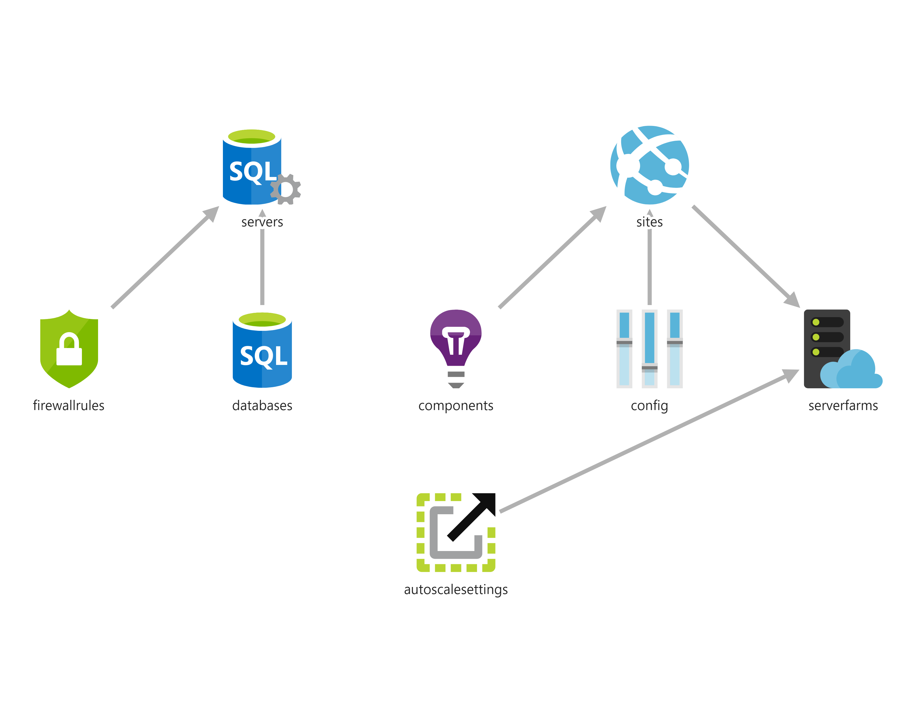
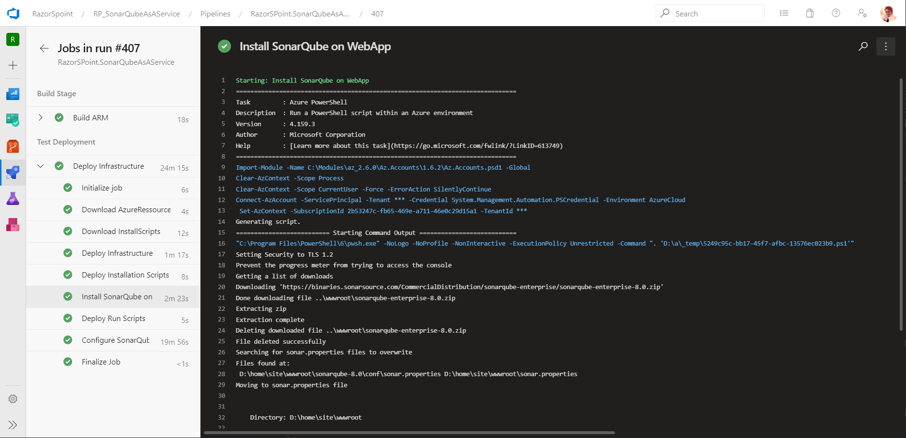

# Sonar Qube as a Service

This repository should give you the possibility to automatically deploy SonarQube with Azure SQL on a WebApp deploy via Azure DevOps Pipelines.

## Use Case

When you are in an enterprise environment or you have very strict rules when it comes to intellectual property, then you might not want to use cloud services without a proper NDA (non disclosure agreement) or you do want to limit the number of service provider that you use for different services. In case of SonarQube the SaaS equivalent is SonarCloud. SonarCloud is hosted by SonarSource in their own cloud environment in AWS. But you have no control over it.

Maybe you want to still use this tool in the cloud. This solution gives you the possibility to leverage PaaS services in Azure only and setup the whole solution automatically. The solution gives you the possibility for somebody who wants to implement something like "Static Code Analysis as a Service".

In this case you solve several problems:

* disaster recovery
* fast deployment
* multiple deployments
* all automatically
* best practices for infrastructure, security and governance

The idea is to provide a solution ready to use even in your company or for private use. You might even only want to evaluate SonarQube for yourself without setting it up with a lot of effort.

## Get Started

These are the steps need to deploy the solution. If you know how to do it, then go forward. Otherwise I linked the explanation to the sections further below.


1. [Register Azure AAD App](#Authentication-with-Azure-AAD)
2. [Create a project on Azure DevOps](#Create-a-Azure-DevOps-Project)
3. [Create a Service Connection in your Project](#Create-a-Service-Connection)
4. [Create Variable group](#Create-a-Variable-Group)
5. [Integrate Pipeline into Azure DevOps]()
6. Run Pipeline
7. Add SonarQube license key

## Architecture

The architecture allows PaaS (platform as a service) only to leverage Azure service to the fullest. The following resources are being created:

* web app with app service plan
* Azure sql server with a database
* application insights getting telemetry from the web app

See the image below to get an impression of the overall architecture.



The architecture tries to follow best practices for security.
Also the access to SonarQube is restricted to Azure AD accounts only.

### ARM Template

show arm template parts and explain parameters

### Deploy Infrastructure Only

If you want to deploy only the infrastructure directly over the portal, you can use the deploy buttons.

<a href="https://portal.azure.com/#create/Microsoft.Template/uri/https%3A%2F%2Fraw.githubusercontent.com%2FRazorSPoint%2FSonarQubeAsAService%2Fmaster%2FARM%2Fsonar.azuredeploy.json" target="_blank">
    
</a> <a href="http://armviz.io/#/?load=https%3A%2F%2Fraw.githubusercontent.com%2FRazorSPoint%2FSonarQubeAsAService%2Fmaster%2FARM%2Fsonar.azuredeploy.json" target="_blank">
    
</a>

## Authentication with Azure AAD

You need an application that will be used to authenticate any user against the SonarQube with only AAD accounts. In order to do so, you need to [register an AAD application](https://docs.microsoft.com/en-us/graph/auth-register-app-v2) in your Azure tenant.

The information you need with the pipeline are the following:

* app id
* app secret
* tenant id

You will also need to configure the reply URL for SonarQube. So figure out the web app URL you want to use before you deploy it. You can also [follow the registration process](To create the correct application, please [follow their documentation](https://github.com/hkamel/sonar-auth-aad/wiki/Setup#creating-the-sonarqube-application-in-azure).) described by the SonarQube plugin for AAD authentication.

## Pipeline



### Create a Azure DevOps Project

In order to use this pipeline, you [need an organization](https://docs.microsoft.com/en-us/azure/devops/organizations/accounts/create-organization?view=azure-devops). If you have one, then [create a new project](https://docs.microsoft.com/en-us/azure/devops/organizations/projects/create-project?view=azure-devops&tabs=preview-page#create-a-project).

### Create a Service Connection

Create a service connection being used for the pipeline. Check the microsoft documentation article for [Creating a service connection](https://docs.microsoft.com/en-us/azure/devops/pipelines/library/service-endpoints?view=azure-devops&tabs=yaml#create-a-service-connection)

> **Important:** In order to be able to create a connection to your Azure tenant, you need to have the permission to register applications in your tenant and you must have Owner permissions on your target subscription. If this is blocked in your tenant, you must ask an administrator. [The documentation can give](https://docs.microsoft.com/en-us/azure/devops/pipelines/library/connect-to-azure?view=azure-devops#create-an-azure-resource-manager-service-connection-with-an-existing-service-principal) a more elaborate explanation.

### Create a Variable Group

In order that the project works you need to [create a variable group](https://docs.microsoft.com/en-us/azure/devops/pipelines/library/variable-groups?view=azure-devops&tabs=yaml#create-a-variable-group) in your project.
You find them under the following url pattern, where `{organization}` is your organization and `{project}` is your project name.

```HTTP
https://dev.azure.com/{organization}/{project}/_library?itemType=VariableGroups
```

Create a variable group with the name "SonarQube as a Service" (exactly with this name!) and give it a description.
Then create the following variables.

|Name  |Value  |Is Secret  |
|---------|---------|---------|
|AzureConnectionServiceName     |  name of the connection previously created for the pipeline       |   no      |
|SqlAdmin     | name of the sql admin user        |   no      |
|SqlAdminPassword     | secure password of the sql admin       |  yes       |
|SubscriptionGuid     | subscription id where the resources are deployed to        |  no       |
|SuffixName     |  unique string appended to the resource names       |     no    |
|SonarAdmin     |  ssid (mail) of the AAD user that should be added as the initial admin       |     no    |
|SonarAppId     |  app id created in the AAD for authentication       |     no    |
|SonarAppSecret     |  app secret created in the AAD for authentication       |     no    |
|TenantId     |  tenant ID where the app was registered       |     no    |

### Pipeline Variables

The following variables are defined in the pipeline.

|Name  |Description  |
|---------|---------|
|HostingPlan     |  name of the app service plan       |
|SqlDb     |    name of the sql database     |
|SqlServer     |  name of the sql server       |
|Website     |   name of the web app     |
|ResourceGroup     |  name of the resource group to deploy to      |
|SkuCapacity     |  horizontal scale of the web app       |
|SkuSize     |  vertical scale size of the web app       |

## Shoutouts and References

### SonarQube PowerShell cmdlets by [Razvan Stefan Hurhui](https://github.com/Razvanxp)
Used some of the cmdets for accessing the SonarQube api.

**Repository:** https://github.com/Razvanxp/SonarQubePS

### SonarQube on a WebApp basic idea by [Nathan Vanderby (Microsoft)](https://github.com/vanderby)
I used some of the PowerShell scripts like and parts of the ARM template for the web app to get SonarQube running on a PaaS service.

**Repository:** https://github.com/vanderby/SonarQube-AzureAppService  
**Blog Post:** https://devblogs.microsoft.com/premier-developer/sonarqube-hosted-on-azure-app-service/

### SonarQube AAD Authentication Plugin by [The ALM Rangers]()
Created by the ALM rangers and used to secure the SonarQube instance with Azure AD.

**Repository:** https://github.com/hkamel/sonar-auth-aad  
**Blog Post:** https://blogs.msdn.microsoft.com/visualstudioalmrangers/2016/03/29/azure-active-directory-aad-authentication-plug-in-for-sonarqube/  
**Channel 9 Video:** https://channel9.msdn.com/Series/Visual-Studio-ALM-Rangers-Demos/Azure-Active-Directory-AAD-Authentication-Plug-in-for-SonarQube

### ARM Template Viewer by [Ben Coleman](https://github.com/benc-uk)
For the visualization in the architecture documentation I used the VS-Code extension to display the ARM template.
It's much easier than doing the stuff yourself!

**Extension:** https://marketplace.visualstudio.com/items?itemName=bencoleman.armview&ssr=false#overview  
**Repsotiroy:** https://github.com/benc-uk/armview-vscode  
**Blog:** https://benc.dev/blog/