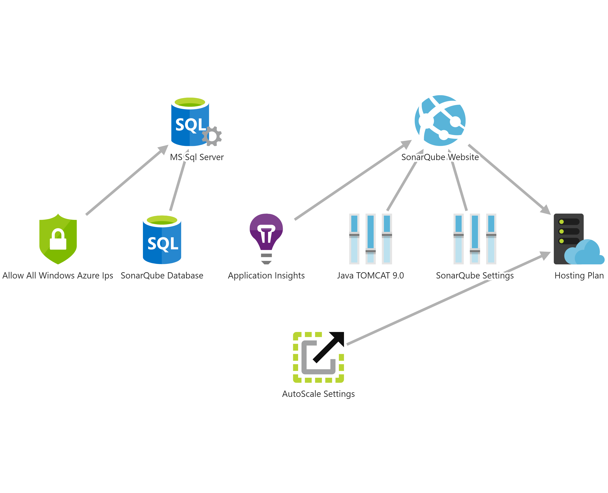

# Sonar Qube as a Service

This repository should give you the possibility to automatically deploy SonarQube with Azure SQL on a WebApp deploy via Azure DevOps Pipelines

## Get Started

These are the steps need to deploy the solution. If you know how to do it, then go forward. Otherwise I linked the explanation to the sections further below.

1. [Register Azure AAD App]()
2. [Create a project on Azure DevOps]()
3. [Create Variable group]()
4. [Create a Service Connection in your Project]()
5. [Integrate Pipeline into Azure DevOps]()
6. Run Pipeline
7. Add SonarQube license key

# Architecture

explain involved architecture



# ARM Template

show arm template parts and explain parameters

## Deploy Infrastructure Only

<a href="https://portal.azure.com/#create/Microsoft.Template/uri/https%3A%2F%2Fraw.githubusercontent.com%2FRazorSPoint%2FSonarQubeAsAService%2Fmaster%2FARM%2Fsonar.azuredeploy.json" target="_blank">
    
</a> <a href="http://armviz.io/#/?load=https%3A%2F%2Fraw.githubusercontent.com%2FRazorSPoint%2FSonarQubeAsAService%2Fmaster%2FARM%2Fsonar.azuredeploy.json" target="_blank">
    
</a>

# Authentication with Azure AAD

# Pipeline

## Create a Azure DevOps Project

In order to use this pipeline, you [need an organization](https://docs.microsoft.com/en-us/azure/devops/organizations/accounts/create-organization?view=azure-devops). If you have one, then [create a new project](https://docs.microsoft.com/en-us/azure/devops/organizations/projects/create-project?view=azure-devops&tabs=preview-page#create-a-project).

## Create a Service Connection

Create a service connection being used for the pipeline. Check the microsoft documentation article for [Creating a service connection](https://docs.microsoft.com/en-us/azure/devops/pipelines/library/service-endpoints?view=azure-devops&tabs=yaml#create-a-service-connection)

[!IMPORTANT]
> **Important:** In order to be able to create a connection to your Azure tenant, you need to have the permission to register applications in your tenant and you must have Owner permissions on your target subscription. If this is blocked in your tenant, you must ask an administrator. [The documentation can give](https://docs.microsoft.com/en-us/azure/devops/pipelines/library/connect-to-azure?view=azure-devops#create-an-azure-resource-manager-service-connection-with-an-existing-service-principal) a more elaborate explanation.

## Create a Variable Group

In order that the project works you need to [create a variable group](https://docs.microsoft.com/en-us/azure/devops/pipelines/library/variable-groups?view=azure-devops&tabs=yaml#create-a-variable-group) in your project.
You find them under the following url pattern, where `{organization}` is your organization and `{project}` is your project name.

```HTTP
https://dev.azure.com/{organization/{project}/_library?itemType=VariableGroups
```

Create a variable group with the name "SonarQube as a Service" (exactly with this name!) and give it a description.
Then create the following variables.

|Name  |Value  |Is Secret  |
|---------|---------|---------|
|AzureConnectionServiceName     |  name of the connection previously created for the pipeline       |   no      |
|SqlAdmin     | name of the sql admin user        |   no      |
|SqlAdminPassword     | secure password of the sql admin       |  yes       |
|SubscriptionGuid     | subscription id where the resources are deployed to        |  no       |
|SuffixName     |  unique string appended to the resource names       |     no    |

## Adjust Pipeline Variables

explain the pipeline

# References

source references
